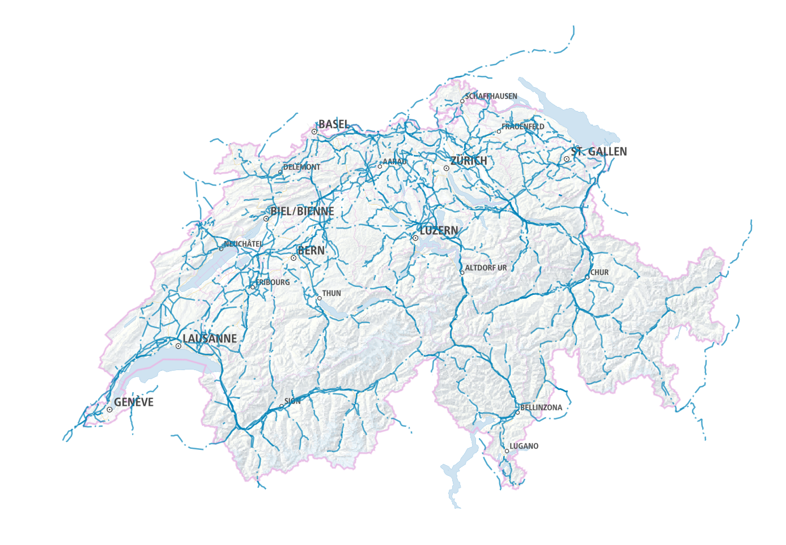

# powerlines-switzerland
Map of powerlines in Switzerland built with Planetiler and PMTiles

[Demo](https://wipfli.github.io/powerlines-switzerland/)



## Generate `powerlines.pmtiles`

Clone Planetiler

```
git clone git@github.com:onthegomap/planetiler.git
```

Install Java 16+, see https://github.com/onthegomap/planetiler/blob/main/CONTRIBUTING.md

Open `PowerlinesOverlay.java` and fill it with:

```java
// content of planetiler/planetiler-examples/src/main/java/com/onthegomap/planetiler/examples/PowerlinesOverlay.java

package com.onthegomap.planetiler.examples;

import com.onthegomap.planetiler.FeatureCollector;
import com.onthegomap.planetiler.FeatureMerge;
import com.onthegomap.planetiler.Planetiler;
import com.onthegomap.planetiler.Profile;
import com.onthegomap.planetiler.VectorTile;
import com.onthegomap.planetiler.config.Arguments;
import com.onthegomap.planetiler.reader.SourceFeature;
import com.onthegomap.planetiler.reader.osm.OsmElement;
import com.onthegomap.planetiler.reader.osm.OsmRelationInfo;
import java.nio.file.Path;
import java.util.List;

public class PowerlinesOverlay implements Profile {

  @Override
  public void processFeature(SourceFeature sourceFeature, FeatureCollector features) {
    if (sourceFeature.canBeLine() && sourceFeature.hasTag("power", "line")) {
      features.line("power")
        .setBufferPixels(4)
        .setMinZoom(6)
        .setAttr("class", "line");
    }
  }

  @Override
  public String name() {
    return "Powerlines Overlay";
  }

  @Override
  public String description() {
    return "An example overlay showing powerlines";
  }

  @Override
  public boolean isOverlay() {
    return true; 
  }

  @Override
  public String attribution() {
    return """
      <a href=\"https://www.openstreetmap.org/copyright\" target=\"_blank\">&copy; OpenStreetMap contributors</a>
      """.trim();
  }

  public static void main(String[] args) throws Exception {
    run(Arguments.fromArgsOrConfigFile(args));
  }

  static void run(Arguments args) throws Exception {
    String area = args.getString("area", "geofabrik area to download", "monaco");
    Planetiler.create(args)
      .setProfile(new PowerlinesOverlay())
      .addOsmSource("osm", Path.of("data", "sources", area + ".osm.pbf"), "geofabrik:" + area)
      .overwriteOutput("mbtiles", Path.of("data", "powerlines.mbtiles"))
      .run();
  }
}

```

Open `planetiler/planetiler-dist/src/main/java/com/onthegomap/planetiler/Main.java` and add:

```diff
 ...
 import com.onthegomap.planetiler.examples.ToiletsOverlayLowLevelApi;
+import com.onthegomap.planetiler.examples.PowerlinesOverlay;
 import com.onthegomap.planetiler.mbtiles.Verify;
 ...

 "benchmark-longlongmap", LongLongMapBench::main,
+"powerlines", PowerlinesOverlay::main,
 "verify-mbtiles", Verify::main,
```

Compile Planetiler:

```
./mvnw -DskipTests=true --projects planetiler-dist -am package
```

Run Planetiler:

```
java -jar planetiler-dist/target/*with-deps.jar powerlines --force=true --area=switzerland
```

Install PMTiles python package:

```
pip3 install pmtiles
```

Convert `data/powerlines.mbtiles` to `data/powerlines.pmtiles`:

```
pmtiles-convert data/powerlines.mbtiles data/powerlines.pmtiles
```
